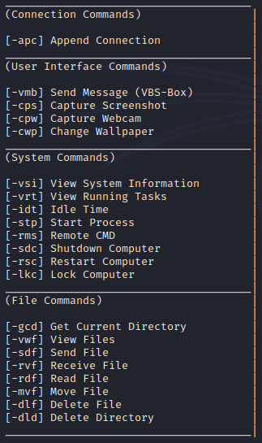

# Windows Backdoor
A Hidden and Undetectable Remote Access Tool written in C++ and Server in Python3

This program utilizes the standard winsock library for sending and receiving data with the server and can be connected to from anywhere as long as it's running and not already connected. There are constants that can be modifed within the client.cpp file such as 'startup' which allows the program to copy itself to the startup, 'SERVER' to allow the client to know what IP and to connect wherever the listening socket is and 'TIMEOUT' to allow the client to indicate when to automatically restart the program when no data is being received (default: 2.5 minutes)

Compile Command: g++ client.cpp -mwindows -o client -lws2_32 (client.cpp file)

[!] Platform: Windows

[!] Compiler: MinGW-64Bit

[!] Port: 5005 (modifiable)

# Usage
[!] Run 'server.py' on your own machine you would like to control the remote client from

[!] Run the compiled 'client.exe' file (client.cpp) on your targets machine with your specified IP Address to allow a connection between

# Contributing
Feel free to submit any possible bugs as I'll be glad to respond to anyone and help with whatever's needed to help fix and improve this program.

# Disclaimer

This program is for educational purposes only! Use at your own risk.
